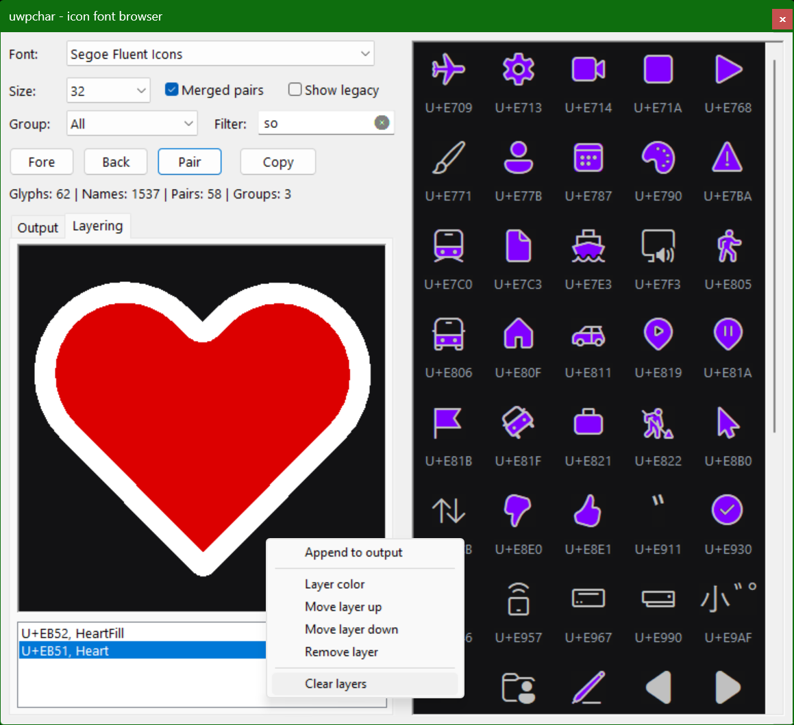

# uwpchar Workflows

`uwpchar.exe` is the authoring side of the font-icon examples. It browses the
installed Segoe icon fonts, names codepoints from generated data, and emits
assembler snippets that can be pasted directly into application code or into
the layered glyph-set viewer.

## Single Glyph Constants

Use `Output` when an application only needs symbolic codepoints. Select a font,
filter by name, and click cells in the glyph grid. Each click appends a
namespaced constant block such as:

```asm
namespace SegoeMDL2
	Camera := 0E722h
end namespace
```

The namespace keeps short names such as `Pin`, `Camera`, and `Up` from colliding
with application symbols. Most applications should choose one face globally and
use the matching namespace throughout.

## Companion Pairs

Leave `Merged pairs` enabled when exploring Segoe MDL2 companion glyphs. Pair
cells draw the fill glyph and outline glyph in one rectangle with separate
colors, but exported names stay unchanged. This keeps the generated code tied to
the published codepoint names instead of inventing role aliases.

Use the color buttons before exporting if you want the preview to match the
target palette:

- `Fore` colors single glyphs and pair outlines.
- `Back` colors the grid and output editor background.
- `Pair` colors merged pair fills.

## Layered Glyph Blocks

Use `Layering` when an icon is a small composition instead of one codepoint.
Click glyph cells to add layers to the stack. Clicking a merged pair adds the
fill layer first and the outline layer second so the outline remains visible.

The layer list is keyboard-driven:

- `Ctrl+Up` / `Ctrl+Down` or `+` / `-` reorder the selected layer.
- `Enter` or `Space` changes the selected layer color.
- `Delete` or `Backspace` removes the selected layer.
- Left-click or right-click the preview to open the context menu.

Use `Append to output` from the preview context menu when the stack is ready.
The exported block is shaped for direct inclusion:

```asm
label icon_layers:icon_layers.bytes/sizeof.FONTICON_LAYER
	FONTICON_LAYER glyph: 0EB52h, color: 000000DCh ; HeartFill
	FONTICON_LAYER glyph: 0EB51h, color: 00FFFFFFh ; Heart
.bytes = $ - icon_layers
```

The label type exposes a layer count through `sizeof.icon_layers`, while
`.bytes` remains available when byte length is needed.

## Moving Work Into glyphset

`glyphset.asm` is the lightweight viewer for a growing collection of layered
icons. To move work from `uwpchar` into it:

1. Paste the emitted `label icon_layers:...` block into a unique namespace in
   `glyphset_layers.inc`.
2. Add a title string in `glyphset_user_strings`.
3. Add one row in `glyphset_user_items` that points at
   `namespace_name.icon_layers`.

Example:

```asm
macro glyphset_user_strings
	glyphset_heart_title GLOBWSTR 'Heart alert',0
purge glyphset_user_strings
end macro

macro glyphset_user_layers
	namespace glyphset_heart
		label icon_layers:icon_layers.bytes/sizeof.FONTICON_LAYER
			FONTICON_LAYER glyph: 0EB52h, color: 000000DCh ; HeartFill
			FONTICON_LAYER glyph: 0EB51h, color: 00FFFFFFh ; Heart
		.bytes = $ - icon_layers
	end namespace
purge glyphset_user_layers
end macro

macro glyphset_user_items
	dq glyphset_heart_title,glyphset_heart.icon_layers
	dd sizeof glyphset_heart.icon_layers
	align 8
purge glyphset_user_items
end macro
```

The explicit `align 8` keeps each `GLYPHSET_ITEM` row aligned without adding a
visible zero-valued padding field.

## Using Other Software

The same exported layer block can feed another renderer if it understands this
record shape:

```asm
struct FONTICON_LAYER
  glyph dd ?
  color dd ?
ends
```

Draw each layer into the same rectangle, in array order, using the selected icon
font face. This GDI path is intended for opaque surfaces. If a target needs a
transparent cached bitmap, prefer glyph outlines or DirectWrite/Direct2D so the
alpha channel is composed correctly.
