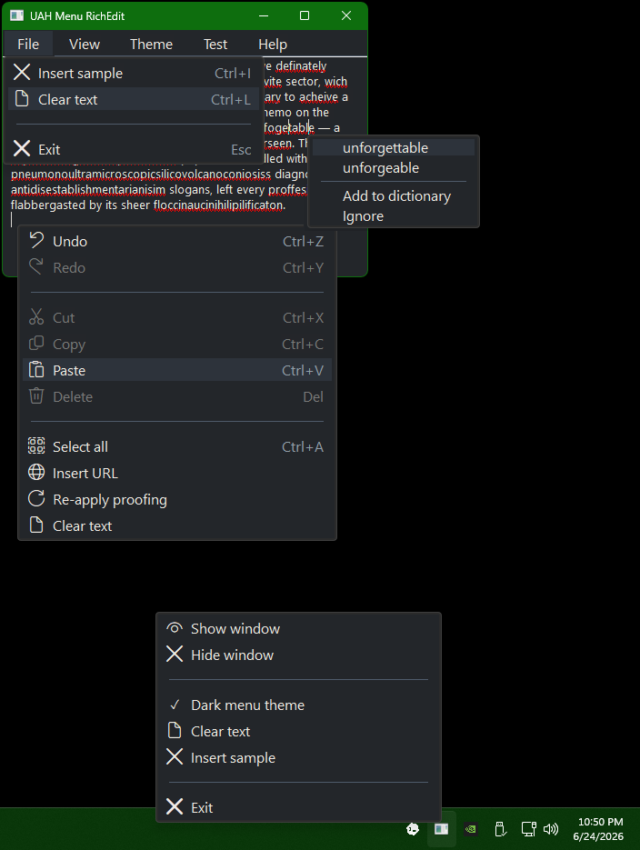

# uah_menu



`uah_menu` demonstrates native popup menu theming through the undocumented
UserApiHook (`WM_UAH*`) menu seam.

The example is deliberately split into reusable pieces:

- `include/addon/uah.inc` supplies UAH constants, translated menu structures,
  `UahIsMenuWindow`, and tolerant `uxtheme.dll` private ordinal wrappers.
- `include/subclass/uah_menu.inc` installs a thread CBT hook and subclasses
  transient `#32768` popup menu windows.
- `examples/uah_menu/menu_painter.inc` is application policy: it measures and
  paints menu items with the local theme.

The app creates a normal overlapped main window with a RichEdit 4.1 control and
a tray icon. The main menu, tray menu, and RichEdit context menu are all native
resource menus. Each item string may begin with a Segoe Fluent Icons glyph; the
UAH painter splits that glyph into a gutter column and draws the label,
accelerator, disabled state, check mark, separator, submenu arrow, and popup
border using the same theme roles.

The RichEdit surface wraps paragraphs to the client width by default and is
configured for rich text, multi-level undo, broad URL detection, advanced
typography/layout, CTF text services, proofing, smart tags, spell checking,
touch keyboard prediction, and IME UI integration. The setup is ordered so
empty-control requirements such as `EM_SETTEXTMODE` run first, then style and
language services are enabled before any sample text is inserted. Startup
appends a high Levenshtein-candidate-density proofing paragraph through
`EM_REPLACESEL`. The RichEdit context menu also exposes a manual proofing
command that reapplies the spell-checking language option without clearing
RichEdit's existing language-option mask. The `Test` menu keeps proofing
trajectories separate: direct store insertion, direct insertion followed by a
sent `WM_CHAR` edit, immediate queued `SendInput` wake, delayed queued
`SendInput` wake, foreground/focus activation, attached-thread focus activation,
CTF open-status forcing, attached Unicode `SendInput`, keyboard-free `WM_PASTE`,
CTF rebinding, and language-option reapplication.

## Build

Use a Visual Studio developer prompt so `rc.exe` is available:

```cmd
cd C:\git\fasm2\examples\uah_menu
_build.cmd
```

## Exercise Points

- Open the menu bar. The popup windows are created by USER32 and discovered by
  the CBT hook.
- Right-click the RichEdit control or a misspelled word. The edit/proofing
  popup uses the same resource and UAH painter path.
- Right-click the tray icon. Tray popup foreground handling and the classic
  posted `WM_NULL` cleanup are included.
- Toggle `Ctrl+D` to switch the app between light and dark menu themes.
- Use `Ctrl+I` to append the dense proofing paragraph again.
- Use the `Test` menu to compare which RichEdit edit paths wake proofing for
  already-present text.
- `Esc` exits; closing the window hides it to the tray.
